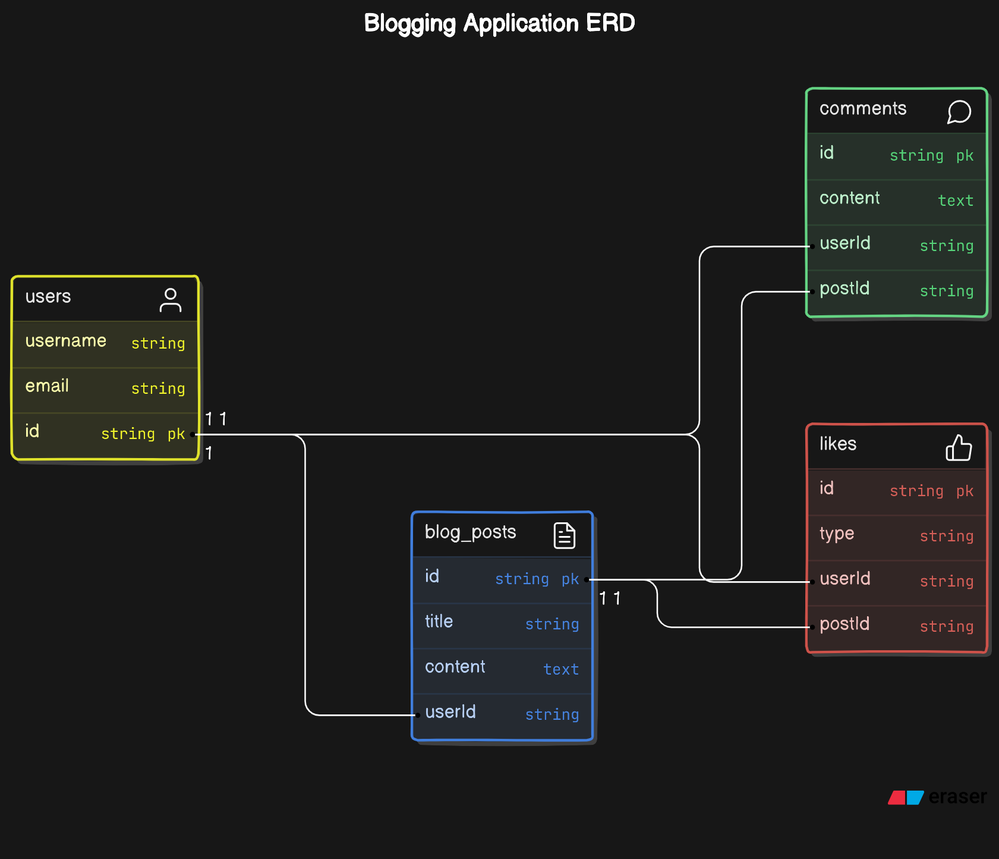

# Create REST full api of blogging app

## features
* use fastapi

* api that allow users to create, read, update, delete blog posts

* users can comment on posts

* users can like dislike the post

## ER Diagram

